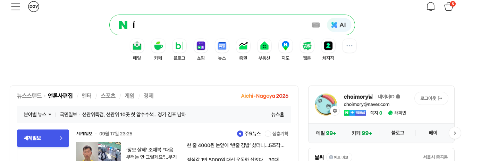

# 개요

- 라이트/다크모드/시스템에따라 설정 (이건 마이페이지에서 유저별 설정으로 다루게 할거임. 기본 다크 테마)
- 플랫폼명은 choimory.dev (choimory-dev 말고)
- pc버전 좌우로 좀 넓혔으면 좋겠음. 좌우 마진이 너무 크네
- 메인 기준으로 플랫폼 하위 서비스들이 아이콘으로 표시되는 방식이면 좋겠음
    
  - 대신 아이콘들을 하나의 카드 안에 아이콘으로 넣어서 구분하는 식으로

---

# 화면 조정 분석

> 분석해봐

## 답변

현재 구현은 “앱형 플랫폼 홈”에 가깝다. 중앙 폭이 좁고, 서비스가 개별 카드 4개로 나뉘어 있다.

반면 `plan2`와 참고 이미지의 방향은 “포털 메인”에 더 가깝다. 네이버 메인처럼 상단에 브랜드/검색/유틸이 있고, 그 아래에 서비스 아이콘 런처가 하나의 영역 안에 모여 있는 형태다.

## 현재 구현과 어긋나는 점

- 플랫폼명
  - 현재 코드: `choimory-dev`
  - 방향: `choimory.dev`
- 테마
  - 현재 코드: OS 설정 기반 라이트/다크
  - 방향: `라이트 / 다크 / 시스템` 선택 가능, 기본은 다크
  - 마이페이지가 생기기 전까지는 기본 다크 테마를 우선 적용하고, 이후 유저 설정으로 확장하는 것이 좋음
- PC 폭
  - 현재 코드: `max-w-[560px]` 중심의 매우 좁은 모바일형 레이아웃
  - 방향: PC 메인 화면은 좌우 마진을 줄이고 더 넓게 사용
  - 단, 커뮤니티 내부 피드는 모바일형 좁은 폭을 유지해도 됨
- 서비스 표시 방식
  - 현재 코드: 서비스별 큰 카드 그리드
  - 방향: 하나의 카드 안에 하위 서비스 아이콘들을 모아 표시
  - `ServiceLauncherCard` 같은 구조가 적합함
- 메인 화면 성격
  - 현재 코드: 오늘 요약 + 서비스 카드 + 최근 활동
  - 방향: 검색/서비스 런처/요약 콘텐츠가 있는 포털형 홈

## 다음 구현 방향

- `/` 플랫폼 홈은 PC 기준 `max-w-[1040px]` 정도로 확장함
- 플랫폼명을 `choimory.dev`로 변경함
- 기본 테마는 다크로 잡고, 나중에 마이페이지에서 라이트/다크/시스템 설정으로 확장할 수 있게 토큰 구조를 유지함
- 서비스 목록은 개별 카드가 아니라 하나의 서비스 런처 카드 안에 아이콘 버튼 목록으로 표시함
- `/community`는 서비스 내부 화면이므로 기존처럼 모바일형 좁은 피드 레이아웃을 유지함
